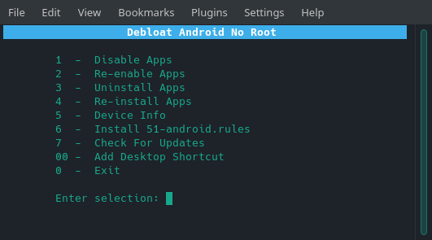

## Debloat Android No Root v2.0

This tool is for debloating non rooted android devices. It uses the adb method of uninstalling or disabling apps.

- For Android 4.0+
- Tested on ubuntu & manjaro linux

## Project Page

<https://techstop.github.io/debloat-android-no-root/>

## Usage

Make sure the `bda` file has execute permissions.

1. Enable usb debugging on your device in developer options and then plug it to your computer.
2. Execute the file as follows in a terminal: `./bda`
3. optional - Use the "Add Desktop Shortcut" option for quick access