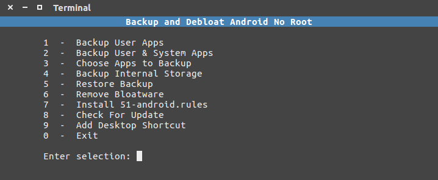

## Backup and Debloat Android No Root v1.2

A tool for creating backups and debloating non rooted android devices. This tool uses the adb method of backing up and uninstalling apps.

- For Android 4.0 and up
- Tested on ubuntu & xubuntu

## Project Page

<https://techstop.github.io/backup-and-debloat-android-no-root/>

## Usage

Make sure the `bda` file has execute permissions.

1. Enable usb debugging on your device in developer options and then plug it to your computer.
2. Execute the file as follows in a terminal: `./bda`
3. optional - Use the "Add Desktop Shortcut" option for quick access

### Resources

[dos2unix](https://waterlan.home.xs4all.nl/dos2unix.html)
